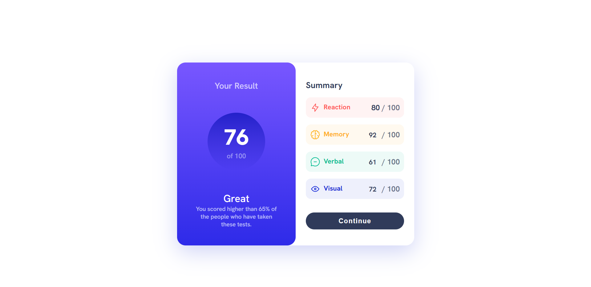
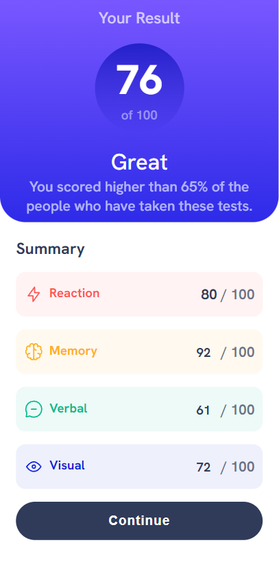

# Results summary component

This is a solution to the [Results summary component challenge on Frontend Mentor](https://www.frontendmentor.io/challenges/results-summary-component-CE_K6s0maV) using ReactJS.

## Table of Contents

- [Overview](#overview)
  - [Screenshot](#screenshot)
  - [Links](#links)
- [Features](#features)
- [Technologies](#technologies)
- [Setup](#setup)
- [Credits](#credits)

## Overview

This  project is a responsive Results summary component.

### Screenshot

|  |  |
| ------------------------------ | ----------------------------- |
| Desktop version                | Mobile version                |

### Links

- [View the live site]()
- [View the Frontend Mentor challenge](https://www.frontendmentor.io/challenges/ping-coming-soon-page-8JqbgoU62)

## Features

- Responsive design for desktop, tablet, and mobile screens
- Hover and focus states for all interactive elements on the page

## Technologies

- ReactJS
- HTML/CSS

## Setup

1. Clone the repository.
2. Run `npm install` to install the project dependencies.
3. Run `npm start` to start the development server.
4. Open `http://localhost:3000` in your web browser to view the project.

## Credits

Design inspiration and assets provided by [Frontend Mentor](https://www.frontendmentor.io/)
- My LinkedIn: [@malekbentaher](https://www.frontendmentor.io/profile/malek-bt)
- My Frontend Mentor: [@malek-bentaher-361028222](https://www.linkedin.com/in/malek-bentaher-361028222/)